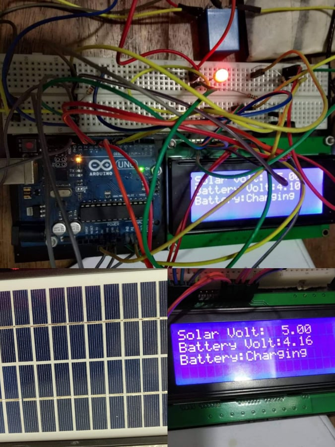

# Solar-Charge-Controller with auto load disconnect on low battery
The 12 volt of the solar panel is converted into 6 volt by a by LM2596 Buck Converter to feed the 6 volt Sunca battery. A relay switch along with BC 547 transistor is used to turn on the switch when the voltage level of the battery remains lower than the solar panel. The arm based microcontroller (Arduino UNO) automatically turns off the relay switch by the transistor after reading the voltage level of the battery by analog pin. TIP 122 NPN transistor is used to disconnect the load from the battery when the voltage level of the battery is too low to save the battery life. The solar and battery voltage and the charging condition is shown in the liquid crystal display.

